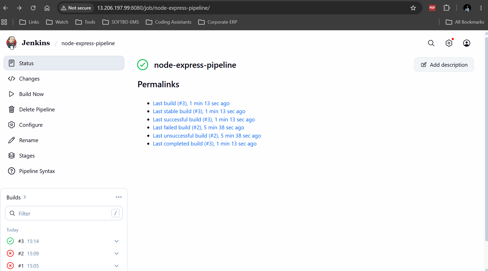
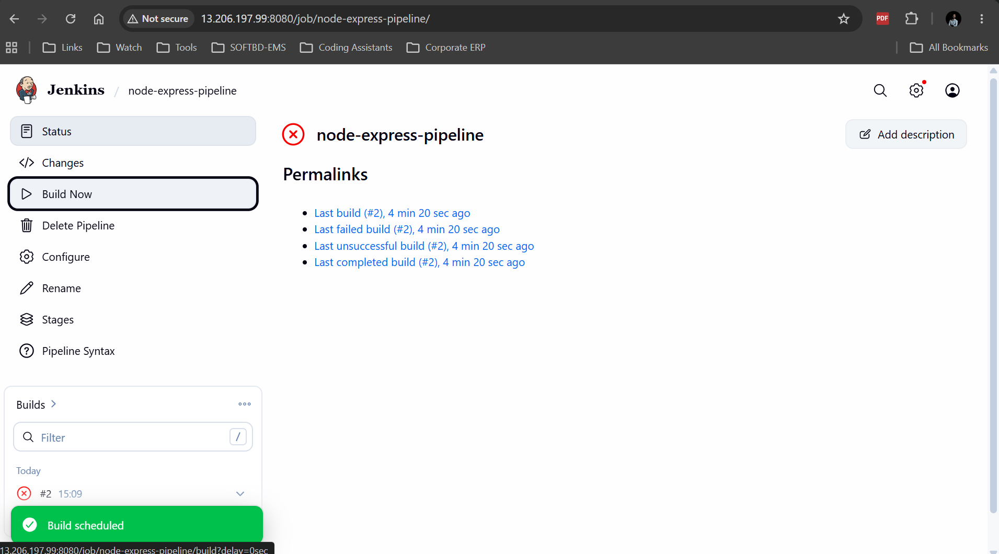
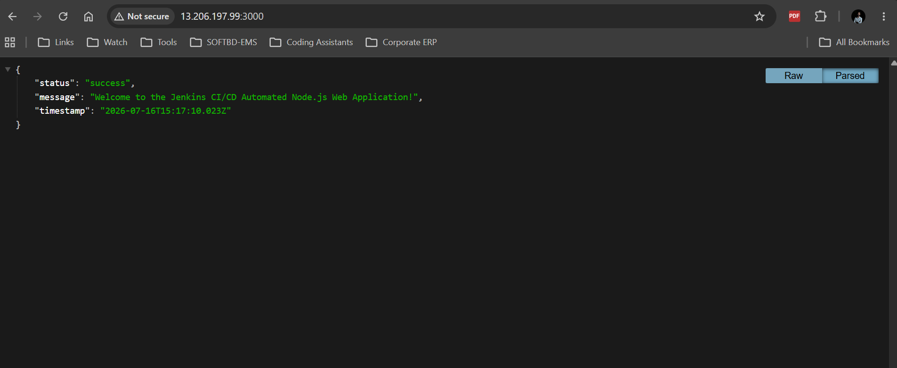
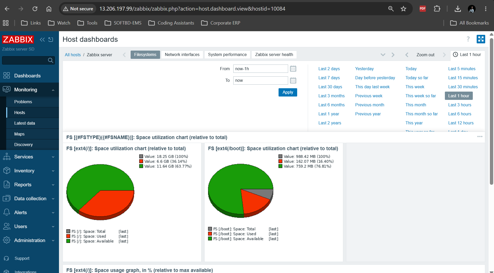

# CI/CD Pipeline & Infrastructure Monitoring Report
**Course Assignment: Module 13**  
**Author:** [Your Name]  
**Infrastructure Target:** AWS EC2 (Single Ubuntu `t3.medium` Instance)

---

## 1. Executive Summary

This project demonstrates the implementation of a modern DevOps workflow featuring a continuous integration and continuous deployment (CI/CD) pipeline alongside real-time infrastructure monitoring. 

On a single **AWS EC2 (Ubuntu 22.04 LTS)** instance, we successfully provisioned and configured:
1. **Jenkins Automation Server:** To pull, build, unit-test, and containerize a Node.js Express application, then push it to Docker Hub and deploy it on the local host.
2. **Zabbix Monitoring Server & Agent:** To monitor server resources (specifically CPU utilization and memory capacity) and configure triggers to alert administrators on critical thresholds.

---

## 2. Infrastructure Setup & Network Security

To ensure services are accessible and secure, the single AWS EC2 instance was launched with the following port configurations in its Security Group:

| Service | Port | Protocol | Purpose | Access Scope |
| :--- | :--- | :--- | :--- | :--- |
| SSH | 22 | TCP | Instance Remote Management | Administrator IP |
| HTTP (Zabbix) | 80 | TCP | Zabbix Frontend Dashboard | Public (or admin IP) |
| Node.js App | 3000 | TCP | Express App Endpoint | Public (or test client) |
| Jenkins | 8080 | TCP | Jenkins Web Automation Console | Public (or admin IP) |
| Zabbix Agent | 10050 | TCP | Agent Listener Port | localhost |
| Zabbix Server | 10051 | TCP | Server Trapper/Listener | localhost |

---

## 3. Part 1: Jenkins CI/CD Pipeline Implementation

### 3.1 Application Architecture
We deployed a simple **Node.js Express** web application. It includes:
* A welcome homepage (`GET /`)
* A status endpoint (`GET /health`)
* A test suite powered by **Jest** and **Supertest** to execute automated unit testing during the build stage.
* A `Dockerfile` defining a lightweight Alpine-based container environment.

### 3.2 CI/CD Pipeline Flow (Jenkinsfile)
The pipeline is structured using a declarative **Jenkinsfile** with the following stages:

1. **Checkout**: Automatically pulls the latest source code branch from GitHub.
2. **Install Dependencies**: Runs `npm install` on the codebase to fetch libraries required for building and testing.
3. **Run Tests**: Executes `npm test` using Jest to ensure no regressions are introduced.
4. **Docker Build & Push**:
   * Packages the application into a Docker image tagged with the build number and `latest` (`dasujandb/node-express-app:latest`).
   * Authenticates securely using Docker Hub credentials configured in the Jenkins Credential Store.
   * Pushes the image to the remote Docker Hub registry.
5. **Deploy**:
   * Identifies if an old container instance of the application is running.
   * Safely stops and deletes the old container.
   * Runs the new container on port `3000`.

### 3.3 Pipeline Execution Screenshots
Below are the visual validations of the successful Jenkins pipeline deployment:

#### Jenkins Pipeline Stage View
This screen demonstrates that all pipeline stages (Checkout, Install Dependencies, Run Tests, Docker Build & Push, Deploy) executed successfully in sequence.



#### Successful Build Execution Console/Dashboard
This screenshot verifies the final status of a successful build run.



#### Application Running in Browser
This screenshot verifies that the application is successfully deployed and reachable in the web browser at port 3000.



---

## 4. Part 2: Zabbix Infrastructure Monitoring

### 4.1 Setup & Configuration
A Zabbix 7.0 LTS Server was installed with a **MySQL** database backend. The **Zabbix Agent** was installed on the same host and configured to track operating system metrics. 

Key metrics tracked include:
* **CPU Monitoring:** CPU load averages, user/system utilization, and context switches.
* **Memory Monitoring:** Total available vs. used RAM, page cache, and swap space.

### 4.2 Thresholds & Trigger Configuration
We configured a custom alert trigger on the host to monitor CPU usage spikes.
* **Trigger Name:** `High CPU Utilization (Greater than 80%)`
* **Expression:** `{jenkins-ec2-node:system.cpu.util[,system].avg(5m)}>80`
* **Severity:** High / Warning

To test this trigger and verify alert functionality, we ran the `stress` utility on the EC2 shell:
```bash
sudo apt install stress -y
stress --cpu 4 --timeout 120
```
This simulated heavy CPU load, forcing utilization to 100%, successfully firing the Zabbix trigger.

### 4.3 Monitoring Screenshots
Below is the visual validation of the Zabbix monitoring dashboard:

#### Zabbix Host Dashboard & System Metrics
This screenshot demonstrates active, green host communication and CPU/Memory monitoring graphs in Zabbix.



---

## 5. Challenges Faced & Solutions

1. **Jenkins Docker Execution Privileges:**
   * *Challenge:* When the Jenkins container or service tried to run `docker build` or `docker run`, it failed with a permission denied error connecting to the Docker daemon.
   * *Solution:* We resolved this by adding the `jenkins` user to the `docker` Linux group (`sudo usermod -aG docker jenkins`) and executing a restart on the Jenkins daemon (`sudo systemctl restart jenkins`).
2. **Resource Constraints on AWS EC2:**
   * *Challenge:* Running MySQL, Apache, Zabbix Server, Jenkins, and Node.js testing/compilation simultaneously on a standard `t2.micro` (1 GB RAM) instance resulted in out-of-memory errors and kernel freezes.
   * *Solution:* We updated the architecture to a `t3.medium` instance which provides 4 GB of RAM, ensuring stable operation for all software components.
3. **Zabbix Initial Schema Import Errors:**
   * *Challenge:* MySQL strict modes threw exceptions on function definitions when importing the default Zabbix DB script schema.
   * *Solution:* We temporarily set `SET GLOBAL log_bin_trust_function_creators = 1;` in MySQL before performing the `zcat` import, and turned it off afterward to secure the environment.

---

## 6. Key Learnings

* **Secure Secrets Management:** Configuring Jenkins credential stores (like storing Docker Hub passwords securely using `withCredentials`) prevents credentials from leaking into repository code or console outputs.
* **Continuous Integration Feedback Loop:** Executing unit tests *before* compiling the Docker image ensures that broken applications are never pushed to the container registry, keeping the registry clean and deployment environments stable.
* **Proactive Monitoring:** Adding infrastructure monitoring with alerts allows system administrators to resolve scaling/resource bottlenecks (such as high memory leaks or high CPU usage) before it affects customer-facing applications.
